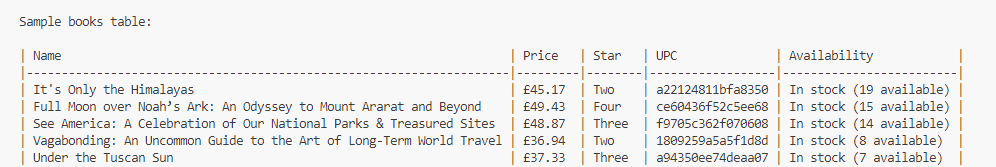

# Book Scraping Project

This project is a web scraper that collects book information from the website [books.toscrape.com](https://books.toscrape.com/) for specific categories ("Travel" and "Nonfiction"). It uses Selenium for browser automation and BeautifulSoup for parsing HTML content.

## Features
- Navigates to selected book categories
- Collects all book detail links in those categories
- Extracts book details such as name, price, star rating, and product information
- Outputs the collected data to the console

## Requirements
- Python 3.7+
- Google Chrome browser
- ChromeDriver (compatible with your Chrome version)
- The following Python packages:
  - selenium
  - beautifulsoup4

You can install the required packages with:
```bash
pip install selenium beautifulsoup4
```

## Usage
1. Make sure you have [ChromeDriver](https://sites.google.com/chromium.org/driver/) installed and accessible in your PATH.
2. Clone this repository or copy the script to your local machine.
3. Run the script:
   ```bash
   python rakip_fiyat_analiz.py
   ```
4. The script will open a Chrome browser, navigate through the categories, and print book details in the terminal.

## Main Functions
- `get_category_detail_urls(driver)`: Returns the URLs of the selected categories.
- `get_book_links_from_category(driver, category_url)`: Returns all book detail links from a category page.
- `get_book_detail(driver, book_url)`: Extracts and returns details of a book from its detail page.

## Sample Output

Below is an example of the output you will see after running the script:
<>


## Notes
- The script is designed for educational purposes and works with the demo site books.toscrape.com.
- Make sure your ChromeDriver version matches your installed Chrome browser version.

---
Feel free to modify or extend the script for your own use cases! 


The following code prints a sample of the scraped books in a table format:

```python
from tabulate import tabulate

sample_details = product_details[:5]

table = []
for detail in sample_details:
    table.append([
        detail["name"],
        detail["price"],
        detail["star"],
        detail["product_info"].get("UPC", ""),
        detail["product_info"].get("Availability", "")
    ])

headers = ["Name", "Price", "Star", "UPC", "Availability"]
print("\nSample books table:\n")
print(tabulate(table, headers, tablefmt="github"))
```
``` 
